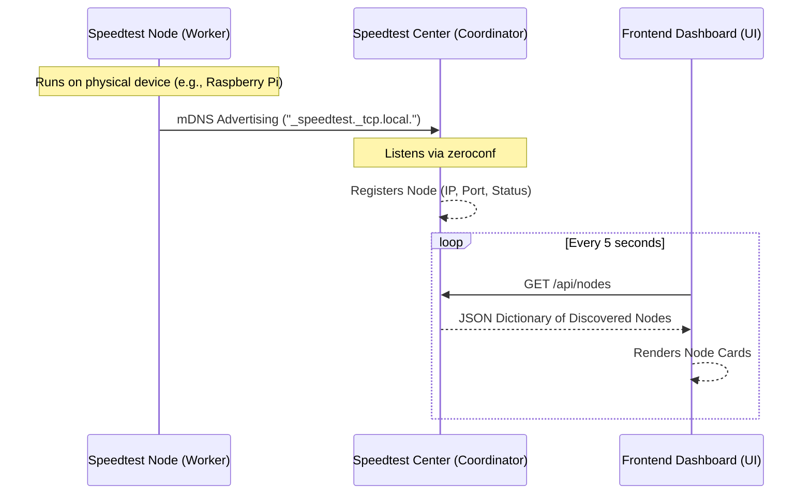
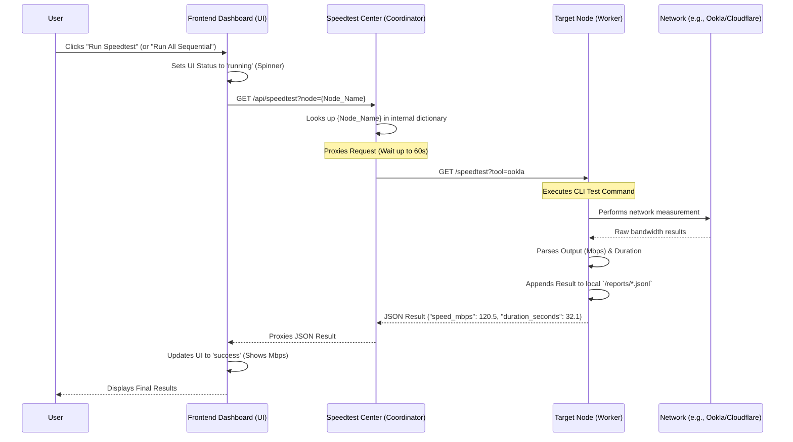

# Wi-Fi Speedtest Center Data Flow

This document describes the high-level data flow for discovering network nodes and executing speed tests in the Wi-Fi Speedtest Center ecosystem.

## Node Discovery Flow

## Speedtest Execution Flow

